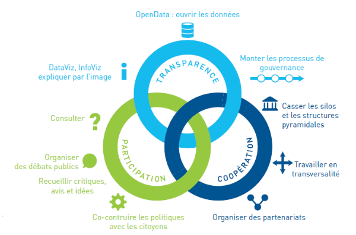
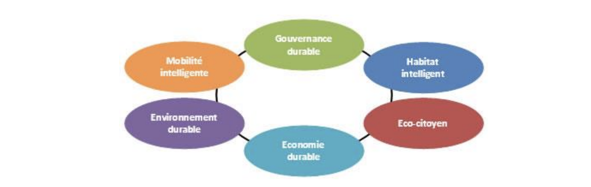
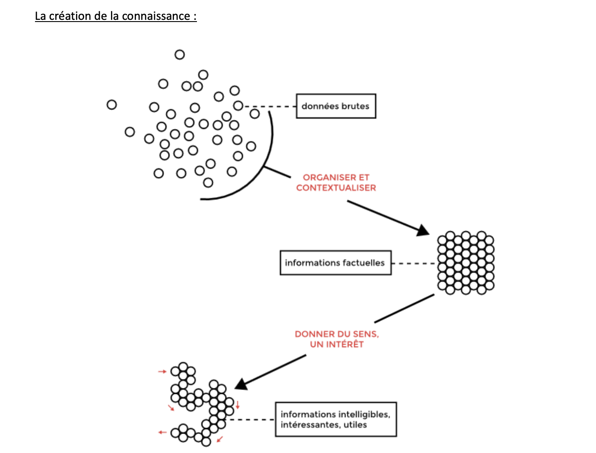
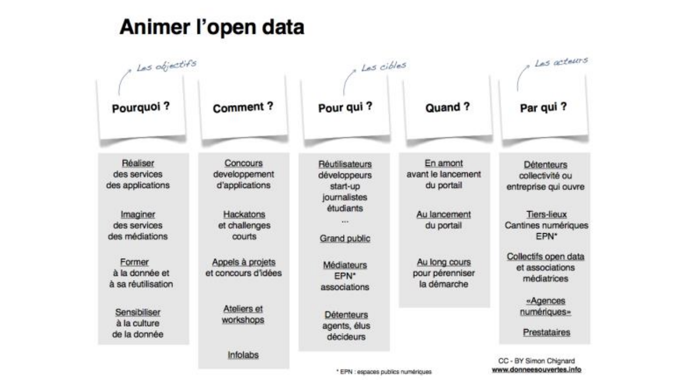

## L’importance de l'ouverture des données pour un État fournisseur de données, permettant une meilleure transparence, une meilleure prise de décision et favorisant l'innovation📊🪩

# Introduction:

Depuis 2010, l'Open Data a émergé en France, d'abord initiée par quelques collectivités avant de se répandre avec un soutien politique national et local. Ces initiatives s'ajoutent à des mouvements antérieurs issus du monde du libre et du collaboratif, enrichissant ainsi le paysage des données ouvertes. L'ouverture des données est perçue comme cruciale pour le développement territorial, car la décision territoriale repose sur la connaissance. Cette dernière se décline en trois niveaux : l'information territoriale issue de données brutes, la compréhension des dynamiques territoriales et leur utilisation dans les décisions politiques. L'Open Data offre un potentiel d'objectivation de cette connaissance, essentielle pour le développement territorial.
Ainsi, l'impact de l'Open Data sur la création et le partage de la connaissance territoriale est examiné, en se basant sur des études et expériences institutionnelles. L'analyse commence par définir l'Open Data, puis explorer comment cette ouverture des données contribue à la connaissance territoriale. 

# I. Qu’est ce que les Données Ouvertes (Open Data en Anglais) ?

# 1. Définition de l’Open Data :

L'Open Data, ou données ouvertes, fait référence à la pratique de rendre disponibles et accessibles au public des ensembles de données, qu'elles proviennent de gouvernements, d'organisations privées ou d'institutions publiques. Ces données sont généralement disponibles dans un format numérique et sous des licences ouvertes, permettant à quiconque de les utiliser, de les partager et de les redistribuer librement. L'objectif principal de l'Open Data est de promouvoir la transparence, l'innovation et la participation citoyenne en permettant à différents acteurs d'utiliser ces informations pour créer de la valeur ajoutée, prendre des décisions éclairées et développer de nouveaux services ou applications. En offrant un accès ouvert à ces données, l'Open Data favorise le développement de la démocratie en permettant aux citoyens, journalistes, chercheurs et entreprises d'accéder à des informations cruciales.

# 2. Les trois objectifs principaux de l’Open Data :

* favoriser la transparence 
* développer la participation de tous les acteurs
* travailler en coopération

<picture>

</picture>

Source : mc2i, conseil en système d’information

# II. Open Data et connaissance territoriale :

Les données brutes, objectives par nature, sont le point de départ pour créer de l'information et de la connaissance. Dans le contexte du développement territorial, les données permettent de décrire, d'expliquer et de comprendre le fonctionnement des territoires. Cette connaissance ainsi produite est un outil crucial pour la prise de décision, apportant un caractère objectif aux choix effectués. L'ouverture croissante des données publiques élargit considérablement la quantité de données disponibles, mettant en lumière le concept de gouvernance informationnelle des territoires. Cela implique la centralité de l'information dans la formulation et la mise en œuvre des politiques publiques, ainsi que la collaboration accrue entre divers acteurs et disciplines, ce qui favorise des transformations dans les modes de gouvernance.

# 1. La donnée comme outil rationnel d’aide à la décision :

La donnée est souvent considérée comme un outil rationnel d'aide à la décision. En effet, elle constitue la base objective sur laquelle repose l'élaboration de l'information et de la connaissance. En analysant les données, les décideurs peuvent mieux comprendre les tendances, les modèles et les relations dans différents domaines, ce qui leur permet de prendre des décisions éclairées et objectives. L'utilisation de données fiables et pertinentes permet de réduire les incertitudes et les risques associés à la prise de décision, en offrant une base solide sur laquelle fonder les actions à entreprendre. Ainsi, la donnée est un élément crucial dans le processus décisionnel, offrant une approche plus rigoureuse et rationnelle pour résoudre les problèmes et atteindre les objectifs fixés.

L'ouverture des données métiers offre de nouvelles perspectives pour comprendre les territoires à un niveau plus détaillé. Contrairement aux données précédemment accessibles, qui se concentraient sur les phénomènes à l'échelle territoriale, l'Open Data donne accès aux données de gestion, de stocks et de flux, offrant ainsi une vision plus précise des impacts des politiques publiques. Ces données permettent une évaluation plus approfondie des politiques et des moyens de leur mise en œuvre, favorisant l'émergence de modèles de politiques adaptés à des échelles territoriales plus fines. Cette approche, similaire à la gestion différenciée des espaces en environnement, pourrait conduire à une gestion différenciée du territoire, prenant en compte les caractéristiques spécifiques des lieux et des moments. Ce concept s'aligne avec celui de la ville intelligente, où l'ouverture des données publiques joue un rôle clé dans l'optimisation des politiques publiques.

<picture>

Figure 1: liste des critères auxquelles doivent répondre les smart Cities (Giffinger 2007)

Ce concept pourrait être étendu, on pourrait alors parler de territoires intelligents, qui baseraient leur développement sur une gouvernance participative et l’utilisation efficiente et intégrée des TIC qui permettrait une gestion des infrastructures, communicantes (entre elles), adaptables, durables et plus efficaces dans le respect des principes du développement durable. Ces données constituent donc un potentiel nouveau pour faire avancer et évoluer les travaux des chercheurs, des observatoires territoriaux, pour affiner la connaissance territoriale. Mais comment mobiliser ces données pour créer de la connaissance territoriales ?

<picture>

</picture>
Figure 2 : Processus classique de création de connaissance à partir de données brutes (Czich2015) 

Le processus classique de création de connaissance à partir de données brutes est facilement retraçable, comme le montre la figure 2 ci-dessus en partant de la donnée brute, le résultat d’une mesure, qui est en attente, pas encore exploitée, on applique un premier traitement qui permet de transformer la donnée en information factuelle pour cela elle est organisée, regroupée, avec les données similaires afin de lui faire exprimer une information factuelle, qui exprime quelque chose de réel, à ce stade l’information est encore objective, elle exprime un fait. L’étape qui suit vise à mobiliser cette information factuelle, au service de quelques choses, l’information factuelle devient alors une information intéressante. Le croisement de ces informations mobilisées entre elles et leur analyses, leur mise en relation au regard d’une vision plus sensible, du système de valeurs, des expériences et du savoir de celui qui mobilise l’information crée la connaissance. La connaissance est donc issue d’une mise en réflexion de l’information.

# 2. Vers une meilleure mobilisation des citoyens au service de la connaissance territoriale : L’animation de la démarche Open Data.

L'ouverture des données publiques vise à promouvoir la transparence, la modernisation de l'action publique, la participation citoyenne, l'innovation et le développement économique, plaçant ainsi le citoyen au centre de l'Open Data. Elle offre aux citoyens de nouveaux moyens de participation et peut potentiellement engendrer une nouvelle forme d'expertise citoyenne, favorisant une meilleure compréhension de l'action publique et permettant une participation accrue à la co-élaboration des politiques publiques. Alors que le web 2.0 favorise une approche horizontale de la circulation de l'information, l'Open Data introduit une dynamique inverse, nécessitant des compétences multiples pour interpréter les données. Cependant, l'accès et la mobilisation de ces données restent limités, en raison de leur complexité technique et de la visibilité limitée des plateformes Open Data. Pour que cette mobilisation soit efficace, il est crucial de développer une communauté engagée et de fournir une animation continue.

<picture>

</picture>
Figure 3 : Grille d’analyse des dispositifs d’animation de l’Open Data Open Data :

Comme nous le montre Simon Chignard par sa grille d’analyse (figure3), l’animation de L’Open Data répond à 5 questions principales, et peut donc revêtir une multitude de formes. Nous allons nous intéresser à l’animation qui place le citoyen au cœur de l’Open Data, que ce soit le grand public ou les réutilisateurs initiés.

Abdoulaye WADE  
<picture style="margin-left: 25px">

</picture> 
IT Engineer | Software Developer | Digital Transformation Learner | Police Warrant Officer at DGPN🌐🇸🇳 
Linkedln: https://www.linkedin.com/in/abdoulaye-wade-9373a4143/
Github: https://github.com/SonExcellenceWADE